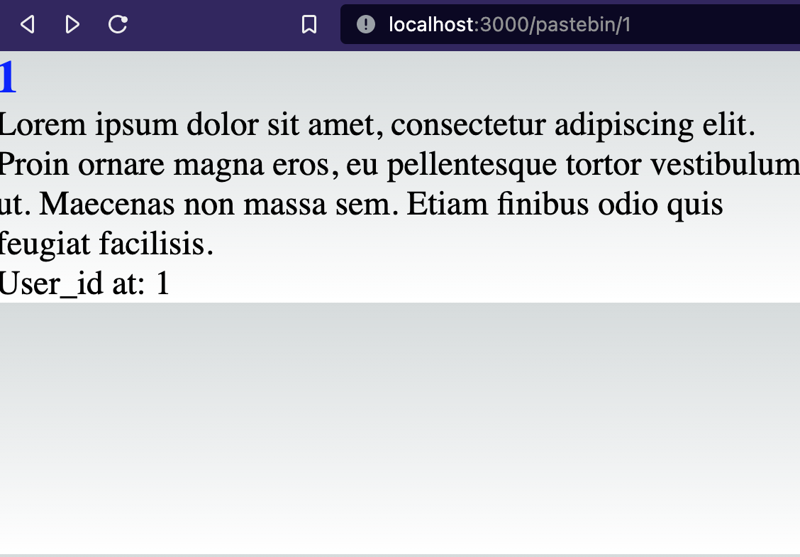
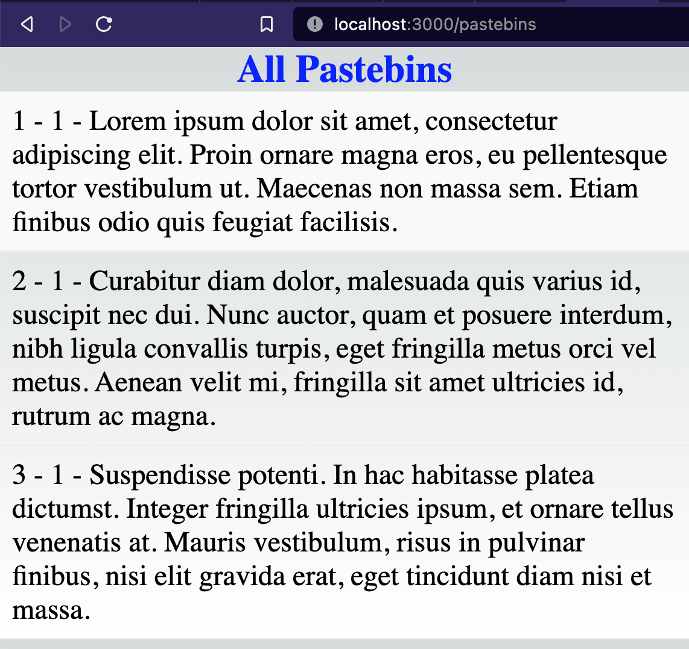
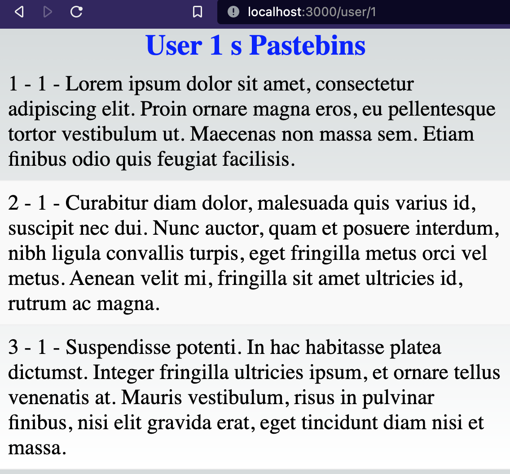

[](https://github.com/mehkey/go-echo-pastebin-web-service/actions/workflows/go.yml)

CI/CD Badge created using using [Github Actions](https://github.com/mehkey/go-echo-pastebin-web-service/actions)

# Go Echo Pastebin Web Service

## [Original Design Github Repo Link](https://github.com/mehkey/system-design/tree/main/designs/Pastebin)


# Functional Requirements

1. As a user I should be able to create a Pastebin
2. As a user I should be able to share the Pastebin with a unique URL
3. Once the pastebin is created, it cannot be modified
4. As a user I should be able to login
5. No password to the pastebin
6. How long is it going to stay up on the website? 90 days.
User should be able to set a custom time on the pastebin
7. All the content in pastebin is Text only.
8. Is there a character limit? Maximum words is 1000 words.


# API 

## `GET /api/v1/users`
Retrieves a list of all users

## `GET /api/v1/pastebins`
Retrieves a list of all pastebins

## `GET /api/v1/user/:id`
Retrieves a specific user by ID

## `GET /api/v1/pastebin/:id`
Retrieves a specific pastebin by ID

## `GET /api/v1/pastebins/user/:userID`
Retrieves all pastebins created by a specific user

## `POST /api/v1/user`
Creates a new user

## `POST /api/v1/pastebin`
Creates a new user

Example response:
```json
[
    {
        "id": 1,
        "name": "John Doe",
        "email": "johndoe@example.com",
        "pastebins": [1, 2]
    },
    {
        "id": 2,
        "name": "Jane Smith",
        "email": "janesmith@example.com",
        "pastebins": [3, 4]
    }
]
```

## `GET /api/v1/pastebins`
Retrieves a list of all pastebins

Example response:
```json
[
    {
        "id": 1,
        "content": "Lorem Ipsum",
        "user_id": 1
    },
    {
        "id": 2,
        "content": "Dolor sit amet",
        "user_id": 2
    }
]
```

## `GET /api/v1/user/:id`
Retrieves a specific user by ID

Example request: `GET /api/v1/user/1`

Example response:
```json
{
    "id": 1,
    "name": "John Doe",
    "email": "johndoe@example.com",
    "pastebins": [1, 2]
}
```

## `GET /api/v1/pastebin/:id`
Retrieves a specific pastebin by ID

Example request: `GET /api/v1/pastebin/1`

Example response:
```json
{
    "id": 1,
    "content": "Lorem Ipsum",
    "user_id": 1
}
```

## `GET /api/v1/pastebins/user/:userID`
Retrieves all pastebins created by a specific user

Example request: `GET /api/v1/pastebins/user/1`

Example response:
```json
[
    {
        "id": 1,
        "content": "Lorem Ipsum",
        "user_id": 1
    },
    {
        "id": 2,
        "content": "Dolor sit amet",
        "user_id": 1
    }
]
```

## `POST /api/v1/users`
Create a new user

Example request:
```json
{
    "name": "John Doe",
    "email": "johndoe@example.com"
}
```

Example response
```json
{
    "id": 1,
    "name": "John Doe",
    "email": "johndoe@example.com",
    "pastebins": []
}
```

## `POST /api/v1/pastebin`
Create a new pastebin

Example request:
```json
{
    "content": "Lorem Ipsum",
    "user_id": 1
}
```

Example Response:
```json
{
    "id": 1,
    "content": "Lorem Ipsum",
    "user_id": 1
}
```

# Data Schema

### Users:
- "id" SERIAL PRIMARY KEY
- "name" varchar
- "email" varchar
- "password" varchar
- "created_at" timestamp DEFAULT CURRENT_TIMESTAMP
- "updated_at" timestamp DEFAULT CURRENT_TIMESTAMP


### Pastebins
- "id" SERIAL PRIMARY KEY
- "content" varchar
- "user_id" int
- "password" varchar
- "created_at" timestamp DEFAULT CURRENT_TIMESTAMP
- "updated_at" timestamp DEFAULT CURRENT_TIMESTAMP


# go-pastebin-web-service

* [cmd/](./go-pastebin-web-service/cmd)
  * [web/](./go-pastebin-web-service/cmd/web)
    * [main.go](./go-pastebin-web-service/cmd/web/main.go)
* [database/](./go-pastebin-web-service/database)
  * [000001_init.down.sql](./go-pastebin-web-service/database/migration/000001_init.down.sql)
  * [000001_init.up.sql](./go-pastebin-web-service/database/migration/000001_init.up.sql)
* [internal/](./go-pastebin-web-service/internal)
  * [datasource/](./go-pastebin-web-service/internal/datasource)
    * [db.go](./go-pastebin-web-service/internal/datasource/db.go)
    * [postgres.go](./go-pastebin-web-service/internal/datasource/postgres.go)
    * [postgres_test.go](./go-pastebin-web-service/internal/datasource/postgres_test.go)
    * [type.go](./go-pastebin-web-service/internal/datasource/type.go)
  * [handler/](./go-pastebin-web-service/internal/handler)
    * [authenticated.go](./go-pastebin-web-service/internal/handler/authenticated.go)
    * [handler.go](./go-pastebin-web-service/internal/handler/handler.go)
    * [pastebin.go](./go-pastebin-web-service/internal/handler/pastebin.go)
    * [pastebin_test.go](./go-pastebin-web-service/internal/handler/pastebin_test.go)
    * [type.go](./go-pastebin-web-service/internal/handler/type.go)
    * [users.go](./go-pastebin-web-service/internal/handler/users.go)
    * [users_test.go](./go-pastebin-web-service/internal/handler/users_test.go)
    * [util.go](./go-pastebin-web-service/internal/handler/util.go)
* [pkg/](./go-pastebin-web-service/pkg)
  * [database/](./go-pastebin-web-service/pkg/database)
    * [postgres.go](./go-pastebin-web-service/pkg/database/postgres.go)
  * [middleware/](./go-pastebin-web-service/pkg/middleware)
    * [jwt.go](./go-pastebin-web-service/pkg/middleware/jwt.go)
    * [logger.go](./go-pastebin-web-service/pkg/middleware/logger.go)
* [.env](./go-pastebin-web-service/.env)
* [.gitattributes](./go-pastebin-web-service/.gitattributes)
* [.gitignore](./go-pastebin-web-service/.gitignore)
* [README.md](./go-pastebin-web-service/README.md)
* [go.mod](./go-pastebin-web-service/go.mod)


/Untitled9.png)


## Commands

```

go mod tidy

go build ./cmd/web

go build ./...

go run ./cmd/web

go test -v   ./internal/datasource 
go test -v   ./internal/datasource 

go test -v ./...

psql -U postgres -h localhost postgres

```


## [Front-End React NEXT Typescript](https://github.com/mehkey/next-typescript-pastebin)









